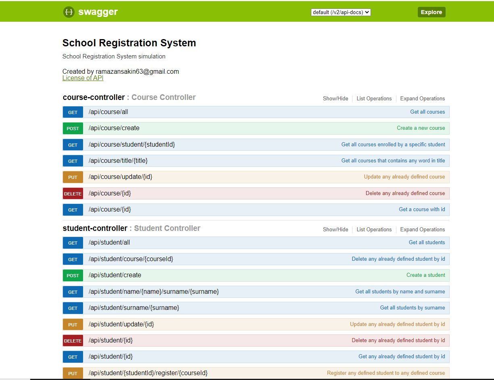

# School Registration System

Sample project for simulating school registration system with students and courses.

Technology stack:

- Java/11
- Maven
- Spring Boot/2.7.1
- JUnit, Mockito
- Hibernate for Spring Data / ORM Implementation
- H2 for local env
- MySQL for docker env
- Actuator for /health and /info apis
- Docker (docker-compose)
- Swagger for api documentation

### How to start service locally:

Everything is ready to start. Default env is local and uses H2 for local run. Because H2 db is faster, easy to use
in-memory db for testing. You just need to start the application and then can use postman collections under
postman_collection folder to test with already defined data.

Go: [Postman Collection](./postman_collection/SchoolRegistrationSystem.postman_collection.json)

### How to start service with docker-compose:

On docker-compose file, everything was configured and ready to start both service and MySQL database. You just need to
clean, install the application.

- mvn clean install
- docker compose up

When you need to down and delete old pods, you can run:

- docker compose down

NOTE: If you want to make some changes on source code, then you need to build the code like
re/cleaning and installing to export updated .jar file than, you need to run:

- docker compose build

After all, you need to use; docker-compose up again to start updated service again.

### Api Documentation / Swagger

You can easily see all the apis for all services with related endpoints and payloads.

Go: http://localhost:8080/swagger-ui.html

### TODO
I also want to add and improve something below but had not much time to work on them.

- DTOs with Mapper/Mapstruct to use on request/responses
- AOP Usage with defining an interceptor to manage logging